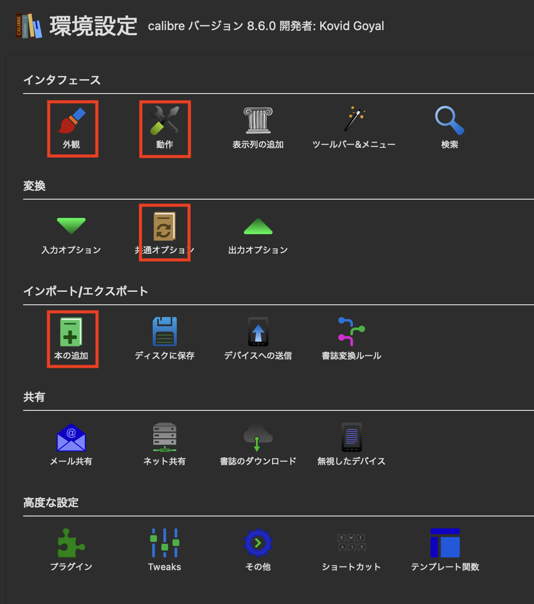
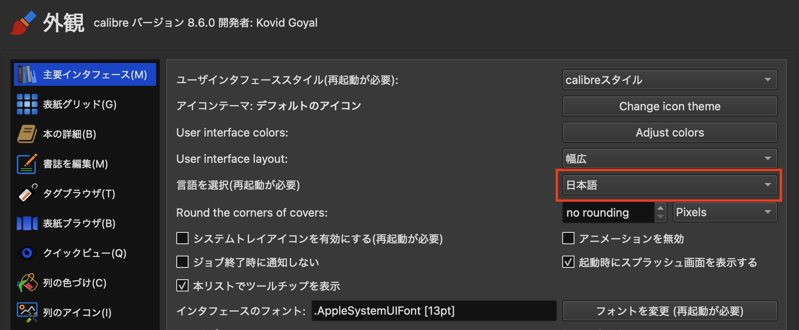
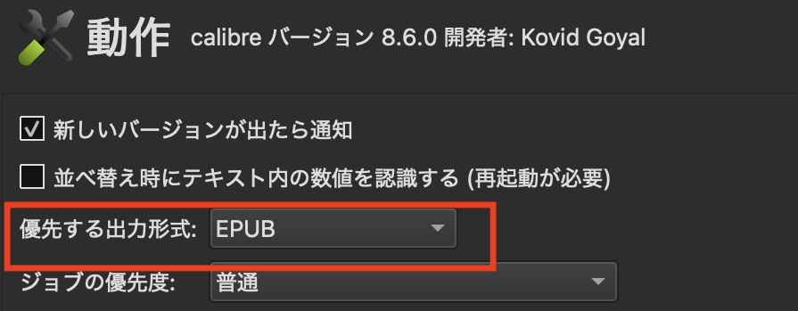
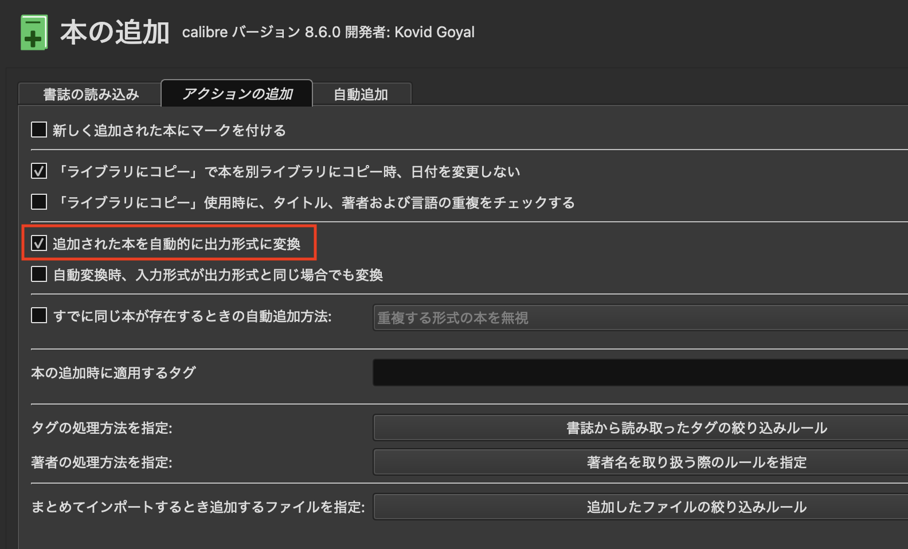
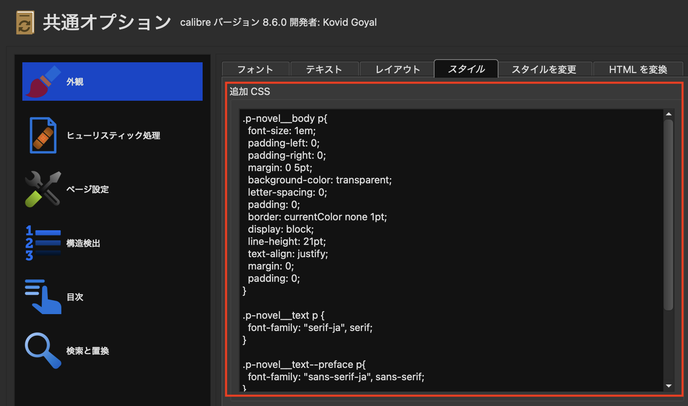
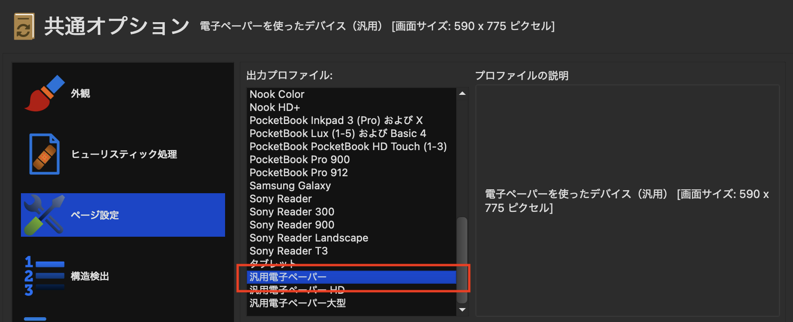
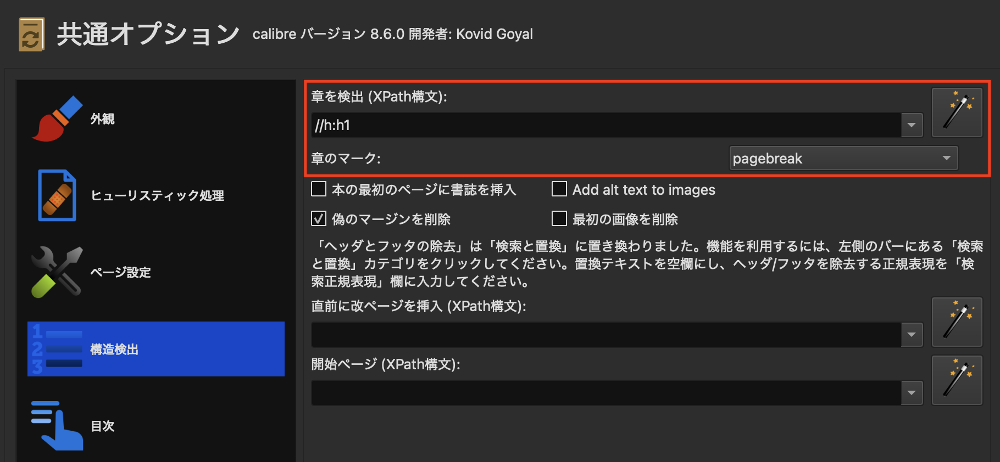
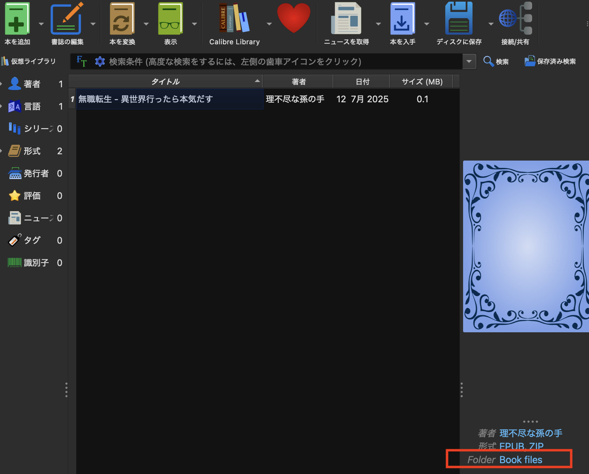
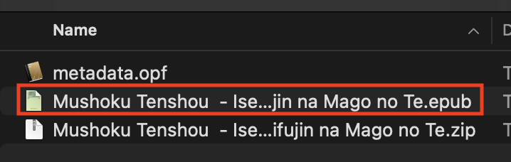
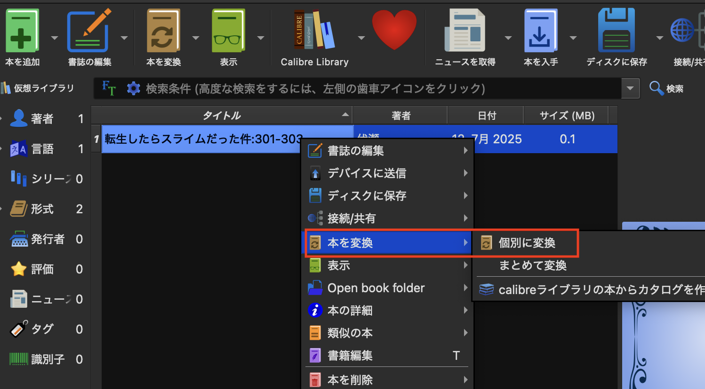

# 「小説家になろう」のデータをダウンロードしてKindleに入れるためのPythonスクリプトとその後の手順書

先日、数十年ぶりにラノベでも読んでみるかと思い立ちました（中学生のころは、ロードス島戦記とか、風の大陸とか、スレイヤーズ、フォーチュンクエストとか、鉄板なやつは全部読んでいた）。「小説家になろう」なるサイトの存在を知ったのですが、老眼になりかけの私には、液晶を見つめる時間を少しでも減らすことが必須です。そこで「なろう」の小説を簡単にKindleで読むためのスクリプトと手順書を作りました。

## 注意事項
* 生成したファイルは法律上私的利用しか認められません。ファイルの配布は犯罪です。絶対にしてはいけません。もし見つけたら本気で刑事告発します。
* 「小説家になろう」のサーバーに負担をかけないよう、パラメータはエイヤで決めてしまい、何回も実行しないようにしましょう。
* プラットフォームを運営し続けるのは大変です。スマホやＰＣが使えるときは、「小説家になろう」のサイトから読んで、広告のＰＶを増やして、ヒナプロジェクトさんを応援しましょう。
* Kindleで読んだ場合でも、「小説家になろう」でブックマークしたり、書いたりして、作家さんを応援しましょう。

## 開発経過
同じニーズを抱えている人はたくさんいるもので、同じ事を実現するためのプログラムはいくつかあるようです。その中で一番メジャーそうなnarou.rbを試させていただいたのですが、
* rubyのインストールが結構大変
* win/mac/linuxで実行方法が違い過ぎ
* narou.rbに必要なライブラリのインストールが手間（aptとかpipみたいに依存関係を一挙解決してくれなかった）
* 必要なライブラリであるAozoraEpub3がそもそも配布を終了している。「改造版」のメンテを有志が行っているようだけれども、先行きが判然としない。
* 実行しようとしたら目次が読めないということでエラー

となって結局使用できませんでした（注：narou.rbに対するdisりの意思はありません。私はこれだけのコードを書く気合いはありませんし、同じ期間だけ保守できる余裕もないです。メンテナの皆さんには敬服しています。）。そこで
* 単なるクロールとテキスト変換だけなのにこんなに苦労する必要ある？
* 小説のファイル変換にGUIはいらない
* ダウンロードとHTML変換はコマンド一発で済ませたい。
* とりあえず「なろう」以外のサイトは対応していなくてよい
* Kindle自体に目次機能があるから、目次ページはいらない
* epub変換部分は利用者が圧倒的に多いCalibreがあるから自分で実装する必要はないよね
* 「なろう」の小説のトップや各チャプターのアドレスは早々変わらないだろうから、それを基準にしてダウンロードするのであれば、ロバストになるよね
* 世の中では縦書き派と横書き派の熱い議論があるようだけれども、筆者は特にこだわりはなく、横書きの作品をわざわざ縦書きにする熱量をもっていないので割愛

という設計思想（思いつき）で作成しています。

## 実行手順
1. Pythonは3系をインストールしてください。インストール方法は「Python インストール　Windos/Mac」でググると山ほど出てきます。
1. 必要なライブラリをインストールします。
	```
	pip install requests beautifulsoup4
	```
1. コマンドライン・ターミナルから以下を実行してください。第１引数は作品コード、第２引数は開始エピソード、第３引数は終了エピソード。以下は「無職転生のエピソード１〜１００を『小説家になろう』から一括ダウンロードし、本文を連結して一つのHTMLとして出力する」コマンドの例です。"python"の部分はインストール方法の指定に従って適宜修正してください。
	```
	python narou-epub.py n9669bk 1 100
	```
	実行したフォルダにcombined_novel.htmlが出力されます。この状態でもKindleに送れますが、チャプターが使えない、フォントが反映されない、表紙が付けられない、書式が読みにくい（行間が広すぎる）等の制限があります。
1. Calibreを実行します。
	* メニューのCalibre->Preferencesを開きます。
	
	* Calibreには「UIの言語設定が出力の言語設定となる」という？？な仕様がありますので、「外観」からUIを日本語にしてください。
	
	* ドラッグアンドドロップで変換する時の形式を指定します。「動作」からepubを指定してください。
	
	* 「本の追加」「アクションの追加」「追加された本を自動的に出力形式に変換」にチェックを入れてください。
	
	* 「共通オプション」「外観」「スタイル」「追加CSS」にstyle.cssの内容をペーストしてください。
	
	* 「共通オプション」「ページ設定」「出力プロファイル」で「汎用電子ペーパー」を選択してください（注：これの効果は未検証）。
	
	* 共通オプションの「章を検出」の中味を以下の文字列に変更し、「章のマーク」をpagebreakに変更してください。
	```
	//h:h1
	```
	
	* narou-dl.pyが出力したファイルをCalibreにドラッグアンドドロップしてください。自動的に変換されます。書誌をクリックして右下のBook Filesをクリックすると保存フォルダが開きます。
	
	* 出力されたファイル(拡張子がepubのもの)をSend to KindleでKindleに送信してください。
	
		* Calibreでファイル名を全角のまま出力する方法がわかりません。テンプレート関数のraw_field()を使えばいけそうに思えるのですが私の方ではエラーになります。どなたか成功した方がいれば方法を教えてください。
	* 表紙に画像を設定したい場合には、」「追加された本を自動的に出力形式に変換」のチェックを外した上で、書誌一覧から対象の書誌を選択し、表紙を設定してから、以上と同じ設定を都度入力してください
	
1. Calibreをこのためにしか使用しないのであれば、自動変換にして、変換設定を○に記載しておけば、htmlをリスト部分にドラッグアンドドロップするだけで、epubが生成されます。
## 制限事項
* タイトルや本文の検出をHTML内のクラスで判別しています。このあたりは「小説家になろう」のCMS出力だと思いますので、仕様が変わると動作しなくなります。

## コードの作成
* 今筆者はプロンプトエンジニアリングの勉強（実験）をしているので、このコードはその習作として作成したものです。掲載しているprompt.mdは１回の実行でコードが得られる内容にしていますが、コードの作成中は、問答を繰り返しながら作成していました。
* 筆者はClaudeを使用しました。出力できるスクリプト名はプロンプトで指定された通りにならないので、適宜ファイル名を修正してください。

